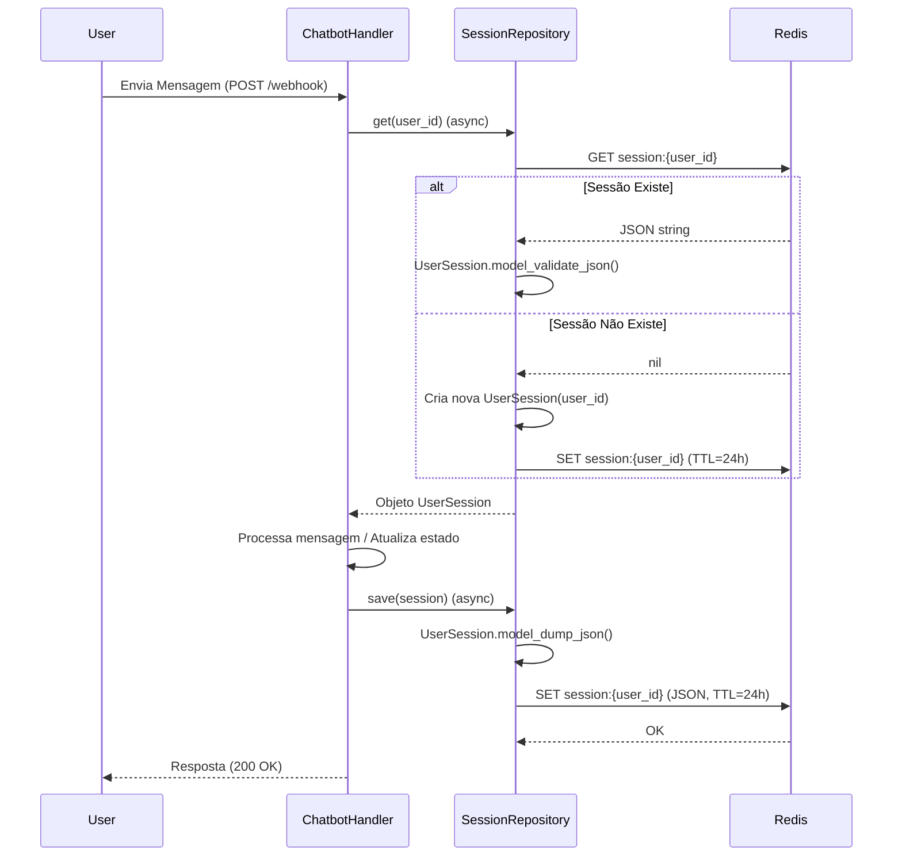

# Relatório de Implementação: Persistência de Sessão com Redis

**Data**: 25/02/2026
**Autor**: Lennon (via Trae AI)
**Atividade**: Substituição de armazenamento em memória por Redis para persistência de sessões de usuário.

## 1. Contexto e Problema

### Local
- `src/instagram/repositories/session.py`
- `src/instagram/handlers/chatbot.py`
- `src/core/config/settings.py`
- `requirements.txt`

### Problema
O sistema utilizava um dicionário em memória (`self._store: dict[str, UserSession]`) para armazenar o estado das conversas dos usuários com o chatbot.
- **Volatilidade**: Reiniciar a aplicação perdia todos os estados de conversa e dados temporários.
- **Escalabilidade**: Em um ambiente distribuído (múltiplos workers, containers, ou réplicas), a memória não é compartilhada. Se uma requisição de um usuário caísse em um processo diferente do anterior, o contexto seria perdido.
- **Concorrência**: Operações em dicionários Python são atômicas, mas em um ambiente async, bloqueios longos de processamento poderiam ocorrer se a manipulação fosse complexa (embora dicionários sejam rápidos).

### Risco
- **Perda de Contexto**: Usuários em meio a um fluxo (ex: suporte aberto) teriam que recomeçar se o servidor reiniciasse.
- **Inconsistência de Dados**: Falha em manter o estado `support_open` ou dados temporários.
- **Falha em Escala**: Impossibilidade de escalar horizontalmente a aplicação sem um armazenamento de sessão compartilhado.

## 2. Solução Implementada

Substituição do armazenamento em memória pelo **Redis** utilizando a biblioteca `redis-py` com suporte a `asyncio`.

### Detalhes Técnicos
1.  **Driver Assíncrono**: Implementação utilizando `redis.asyncio` para garantir operações não bloqueantes no event loop do FastAPI.
2.  **Configuração Centralizada**:
    - Criação da classe `RedisSettings` em `src/core/config/settings.py`.
    - Gestão via variáveis de ambiente (`REDIS_HOST`, `REDIS_PORT`, `REDIS_PASSWORD`, `REDIS_DB`).
3.  **Serialização**: O objeto `UserSession` (Pydantic) é serializado para JSON (`model_dump_json`) antes de salvar e validado (`model_validate_json`) ao ler.
4.  **TTL (Time-To-Live)**: Definido tempo de expiração de 24 horas (86400 segundos) para limpeza automática de sessões inativas, evitando vazamento de memória no Redis.
5.  **Refatoração Async**: Adaptação de todo o fluxo de `ChatbotHandler` para suportar chamadas assíncronas (`await`) ao repositório de sessão.

## 3. Diagramas

### 3.1. Diagrama de Sequência (Fluxo de Mensagem)



### 3.2. Diagrama de Componentes

```mermaid
classDiagram
    class ChatbotHandler {
        +handle_message(sender_id, text)
        -_start_support(sender_id)
        -_handle_support(sender_id, text)
    }
    class SessionRepository {
        -Redis client
        -_ttl: int (86400)
        +get(user_id) UserSession
        +save(session) None
        +delete(user_id) None
    }
    class RedisSettings {
        +host: str
        +port: int
        +db: int
        +password: str
    }
    class RedisServer {
        Key: "session:{user_id}"
        Value: JSON
        TTL: 24h
    }

    ChatbotHandler --> SessionRepository : Usa (async)
    SessionRepository --> RedisSettings : Lê Configuração
    SessionRepository --> RedisServer : Conecta (TCP)
```

## 4. Arquivos Alterados

| Arquivo | Tipo | Alteração |
|---------|------|-----------|
| `requirements.txt` | Dependência | Adição de `redis>=5.0.0` |
| `src/core/config/settings.py` | Configuração | Adição de classe `RedisSettings` e campo `redis` em `Settings` |
| `src/instagram/repositories/session.py` | Lógica | Implementação do client Redis e métodos `async` |
| `src/instagram/handlers/chatbot.py` | Lógica | Adaptação para `await` nas chamadas de repositório |
| `.env.example` | Documentação | Documentação das variáveis `REDIS_*` |

## 5. Próximos Passos Sugeridos
1.  **Monitoramento**: Configurar alertas para falhas de conexão com o Redis.
2.  **Cluster**: Avaliar necessidade de Redis Cluster se a carga aumentar drasticamente.
3.  **Segurança**: Garantir que a conexão com o Redis seja criptografada (TLS) em ambientes de produção, se o Redis não estiver na mesma rede privada segura.
