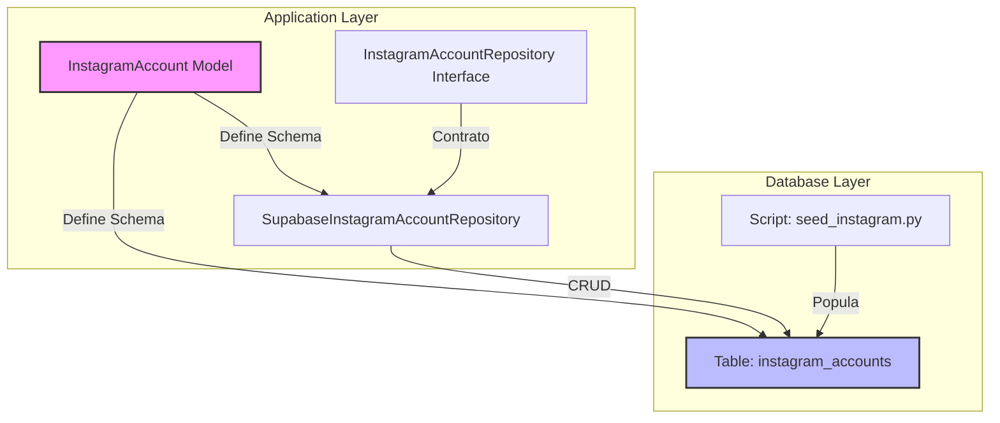
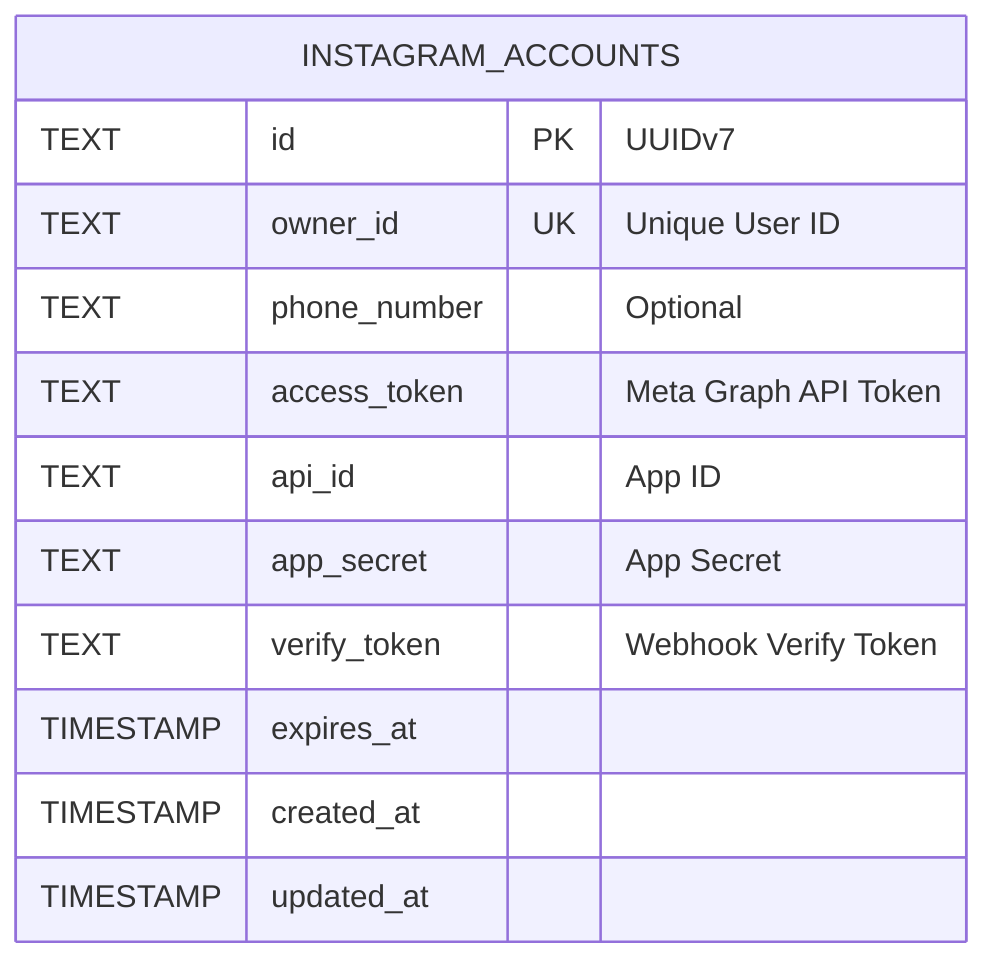

# Relatório de Ajustes de Infraestrutura e Código - Instagram API

**Data:** 25/02/2026 18:43  
**Atividade:** Atualização do Schema, Repositório e Seed da Tabela `instagram_accounts`  
**Autor:** Trae AI Assistant

---

## 1. Contexto

Foi identificado um desalinhamento entre o modelo de dados definido na aplicação (`InstagramAccount`) e a infraestrutura de banco de dados (scripts de migração), bem como na camada de acesso a dados (Repositório) e scripts de população inicial (Seed). O modelo `InstagramAccount` evoluiu para incluir novos campos de autenticação e identificação, removendo campos obsoletos, o que exigiu uma refatoração em cascata para garantir a consistência do sistema.

---

## 2. Problemas Identificados e Soluções

### 2.1. Banco de Dados (Migração)

| Item | Detalhes |
| :--- | :--- |
| **Local** | `scripts/database/migrations/001_create_table_instagram.sql` |
| **Problema** | A definição da tabela `instagram_accounts` estava desatualizada. Continha colunas inexistentes no modelo (`instagram_business_account_id`) e faltava colunas críticas (`api_id`, `app_secret`, `verify_token`). |
| **Risco** | Falhas de execução (Runtime Errors) ao tentar persistir ou ler dados, inconsistência de dados e impossibilidade de autenticação correta com a API do Instagram. |
| **Solução** | **Atualização do DDL (Data Definition Language):** - Remoção de `instagram_business_account_id` e `refresh_token`. - Adição de `api_id`, `app_secret`, `verify_token`. - Ajuste da constraint `UNIQUE` para o campo `owner_id`. |

### 2.2. Camada de Repositório (Interface e Implementação)

| Item | Detalhes |
| :--- | :--- |
| **Local** | `src/instagram/repositories/instagram_account.py` (Interface) `src/instagram/repositories/impl/supabase_instagram_account_repository.py` (Implementação) |
| **Problema** | A interface e a implementação do repositório refletiam o schema antigo. Métodos de busca utilizavam campos removidos (`get_by_instagram_business_account_id`) e não existiam métodos para os novos identificadores. |
| **Risco** | Quebra de contrato da interface, erros `AttributeError` em tempo de execução e incapacidade de buscar contas pelos novos critérios de negócio. |
| **Solução** | **Refatoração do Repositório:** - Remoção de métodos obsoletos. - Criação do método `get_by_api_id`. - Atualização da assinatura e retorno de `get_by_owner_id` para refletir a unicidade (retorna `Optional` em vez de `List`). - Ajuste na implementação `Supabase` para mapear corretamente as queries. |

### 2.3. Script de Seed (População de Dados)

| Item | Detalhes |
| :--- | :--- |
| **Local** | `scripts/database/seed_instagram.py` |
| **Problema** | O script de seed tentava inserir dados em colunas que não existiam mais e não fornecia valores para as novas colunas obrigatórias (`NOT NULL`). A lógica de `ON CONFLICT` também estava baseada em índice inexistente. |
| **Risco** | Falha na inicialização do ambiente de desenvolvimento e testes, impedindo a execução da aplicação com dados mínimos necessários. |
| **Solução** | **Reescrita do Seed:** - Atualização da query SQL de `INSERT` e `ON CONFLICT`. - Mapeamento de variáveis de ambiente (`settings.instagram`) para preencher `api_id`, `app_secret`, etc. - Lógica de *upsert* baseada agora em `owner_id`. |

---

## 3. Diagramas

### 3.1. Fluxo de Dados Atualizado (Componentes)

### 3.2. Estrutura da Tabela (ER Diagram)

---

## 4. Conclusão

As alterações garantem que a infraestrutura de dados (SQL), a camada de persistência (Repository) e os scripts auxiliares (Seed) estejam 100% alinhados com o modelo de domínio (`InstagramAccount`). O sistema agora está robusto para suportar as operações de autenticação e gerenciamento de contas do Instagram conforme os requisitos atuais.

### Próximos Passos Sugeridos
1. Executar a migração no banco de dados para aplicar o novo schema.
2. Rodar o script de seed para validar a inserção de dados.
3. Verificar se há outros pontos do sistema (Services/Routers) que ainda referenciam os campos antigos removidos.
