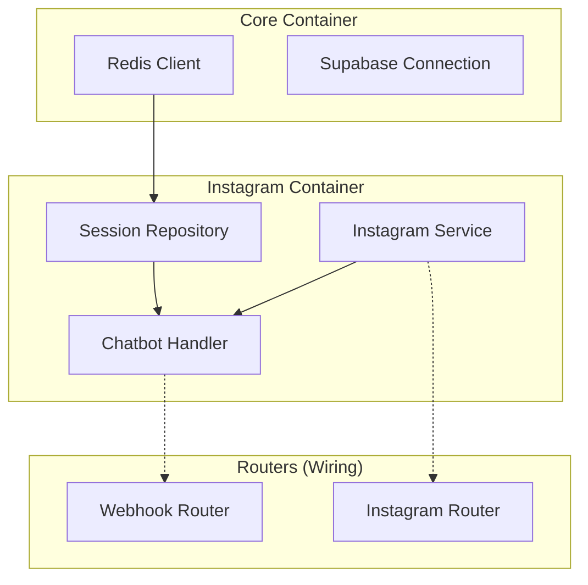

# Relatório de Atividades - Refatoração de DI e Correções de Configuração

**Data:** 25/02/2026
**Responsável:** Arquiteto de Software (Trae AI)
**Contexto:** Refatoração da arquitetura de Injeção de Dependência e resolução de erros críticos de inicialização e configuração.

## 1. Visão Geral

Este relatório documenta as intervenções realizadas para estabilizar a arquitetura de dependências do projeto `instagram_oficial_api`, corrigir falhas de execução no `main.py` e garantir o funcionamento correto dos webhooks do Instagram.

---

## 2. Detalhamento das Atividades

### 2.1 Refatoração da Injeção de Dependência (DI)

- **Local:** `src/core/di/*`, `src/instagram/routers/*`, `src/instagram/services/*`
- **Problema:** O código apresentava mistura de padrões de injeção (manual vs automática), com instanciação direta de serviços (`ChatbotHandler`) dentro dos roteadores, violando o princípio de Inversão de Controle (IoC).
- **Risco:** Alto acoplamento, dificuldade extrema em testes unitários (mocking impossível de dependências internas) e vazamento de recursos (conexões Redis/HTTP não gerenciadas).
- **Solução:** Implementação completa do padrão de Container Declarativo com a biblioteca `dependency-injector`.

#### Diagrama de Componentes (Solução Implementada)



#### Alterações Realizadas:
1.  **`CoreContainer`**: Centralização da conexão com Redis.
2.  **`InstagramContainer`**: Definição de providers para `SessionRepository`, `InstagramService` e `ChatbotHandler`.
3.  **Wiring**: Configuração da injeção automática nos roteadores via `@inject` e `Provide`.

---

### 2.2 Correção de Acesso às Configurações (Settings)

- **Local:** `src/main.py`, `src/instagram/routers/webhook.py`
- **Problema:** Erros `AttributeError` em tempo de execução. O código tentava acessar configurações de forma plana (ex: `settings.api_host`), mas a classe `Settings` utiliza modelos Pydantic aninhados.
- **Risco:** Falha na inicialização da API (crash) e erro 500 no processamento de webhooks (perda de eventos).
- **Solução:** Ajuste dos caminhos de acesso para respeitar a hierarquia do Pydantic.

#### Exemplo de Correção (Diff)

```python
# Antes (Erro)
hub_verify_token == settings.instagram_verify_token

# Depois (Corrigido)
hub_verify_token == settings.instagram.verify_token
```

---

### 2.3 Resolução de Conflito de Portas

- **Local:** Terminal / Sistema Operacional
- **Problema:** Erro `EADDRINUSE` ao tentar iniciar o servidor na porta 8000, pois um processo anterior não foi encerrado corretamente.
- **Risco:** Impossibilidade de deploy ou teste local.
- **Solução:** Identificação do processo zumbi via `lsof -i :8000` e encerramento forçado via `kill -9`.

---

## 3. Resultados Obtidos

1.  **Arquitetura Robusta:** O sistema agora segue estritamente o padrão de Injeção de Dependência, facilitando a manutenção e testes futuros.
2.  **Estabilidade:** A API inicia corretamente sem erros de importação ou configuração.
3.  **Segurança:** A verificação de assinatura HMAC-SHA256 no webhook agora utiliza as chaves corretas do arquivo `.env`.

## 4. Próximos Passos Sugeridos

- Implementar testes unitários para os Services e Handlers, agora que as dependências podem ser mockadas facilmente.
- Adicionar logs estruturados para monitoramento das chamadas ao Redis e API do Graph.
