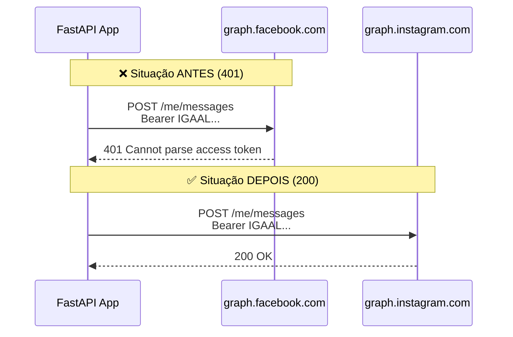
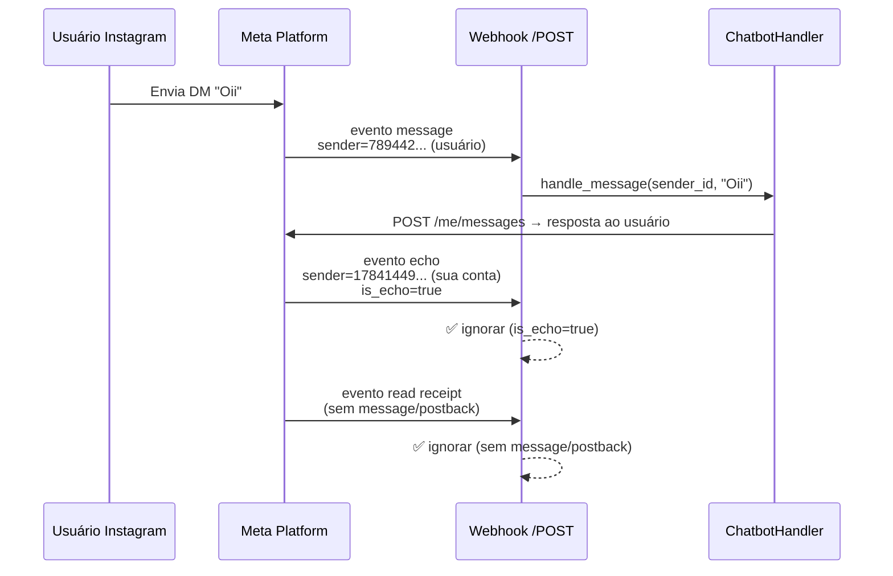
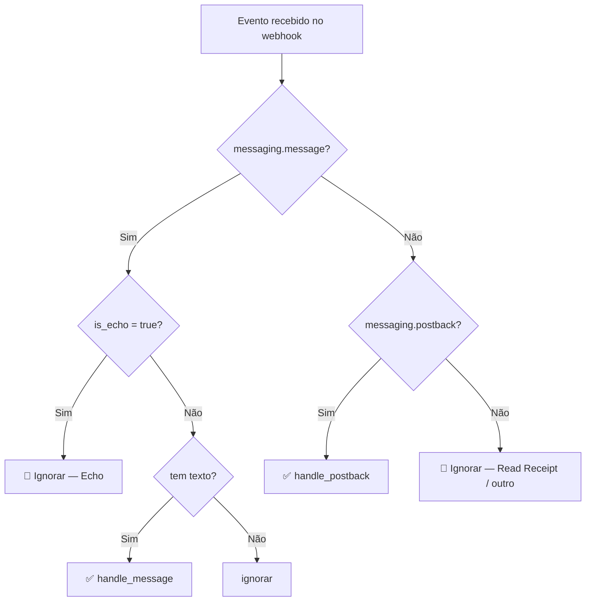
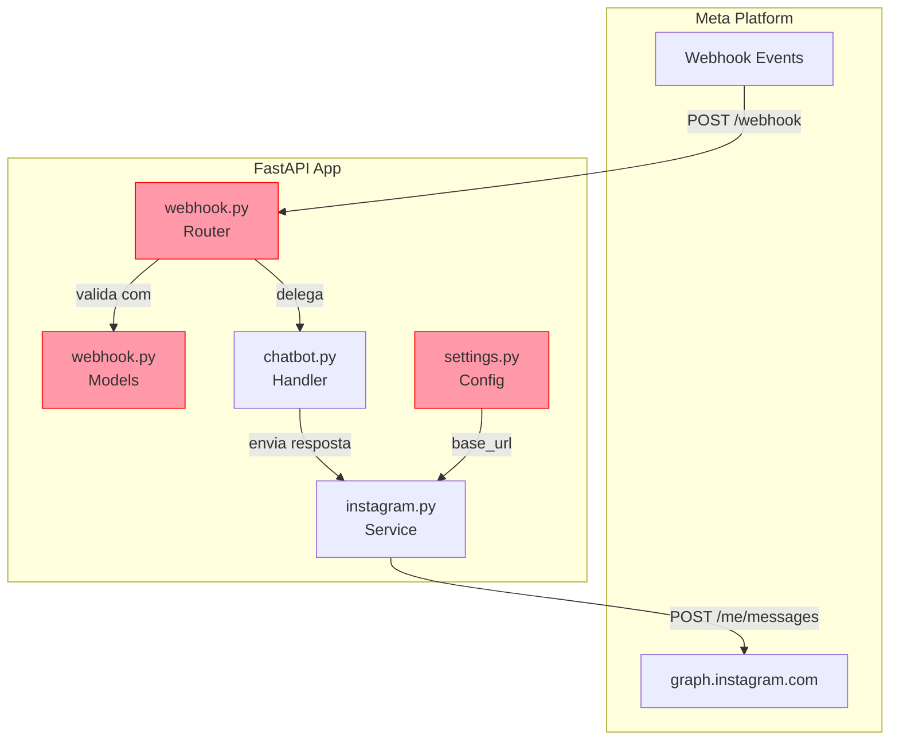
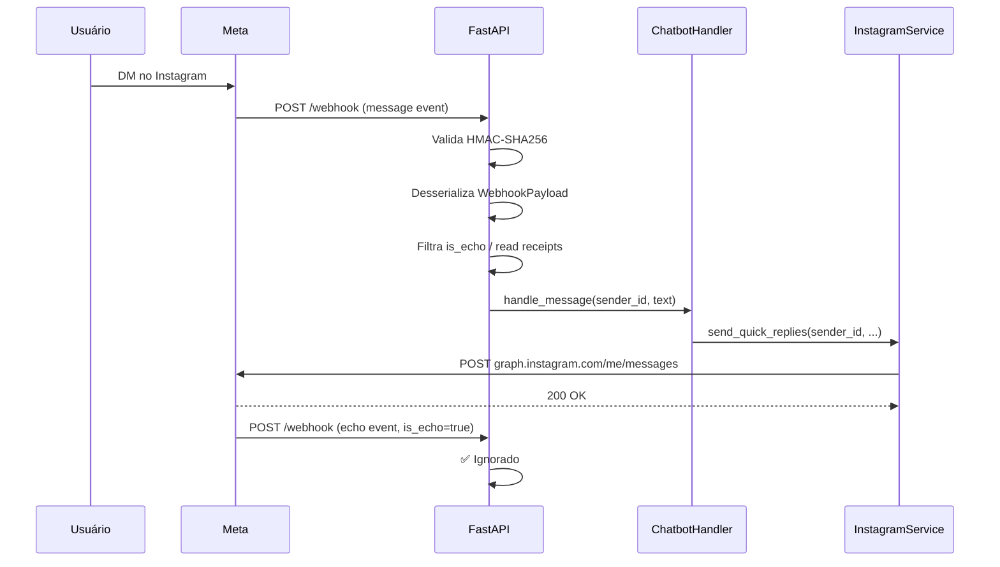

# Report de Debug — Instagram Chatbot API

**Data:** 2026-02-26 10:45  
**Projeto:** `instagram_oficial_api`  
**Stack:** FastAPI · Python 3.12 · httpx · Pydantic v2 · Meta Graph API  

---

## Sumário Executivo

Durante a sessão de debug foram identificados e corrigidos **três problemas distintos** que impediam o funcionamento do chatbot de DMs no Instagram. Os problemas envolveram configuração de URL base da API, token de acesso inválido e processamento incorreto de eventos de echo do webhook.

---

## Problema 1 — Erro 401: Invalid OAuth Access Token

### Local
`src/core/config/settings.py` → classe `InstagramSettings` → propriedade `base_url`

### Problema
O serviço estava enviando requisições para `graph.facebook.com`, mas o token de acesso utilizado era do tipo **Instagram User Token** (`IGAAL...`), que só é aceito pelo endpoint `graph.instagram.com`. A combinação gerava o erro:

```
HTTP/1.1 401 Unauthorized
{"error": {"message": "Invalid OAuth access token - Cannot parse access token", "code": 190}}
```

### Solução
Alteração da propriedade `base_url` na classe `InstagramSettings`:

```python
# Antes
@property
def base_url(self) -> str:
    return f"https://graph.facebook.com/{self.api_version}"

# Depois
@property
def base_url(self) -> str:
    return f"https://graph.instagram.com/{self.api_version}"
```

### Diagrama — Fluxo de Autenticação



---

## Problema 2 — Erro 400: Usuário Não Encontrado (Echo Loop)

### Local
`src/instagram/routers/webhook.py` → handler `receive_webhook`  
`src/instagram/models/webhook.py` → classe `WebhookMessage`

### Problema
A Meta envia dois tipos de evento de mensagem para o webhook:

1. **Mensagem recebida** — `sender.id` = usuário externo
2. **Echo** — `sender.id` = sua própria conta (`is_echo: true`), confirmando que a mensagem foi enviada

O código não filtrava os eventos de echo, então ao receber a confirmação de uma mensagem enviada, tentava responder para **a própria conta** como se fosse um usuário, gerando:

```
HTTP/1.1 400 Bad Request
{"error": {"message": "Não foi possível encontrar o usuário solicitado.", "error_subcode": 2534014}}
```

Adicionalmente, eventos de **read receipt** (confirmação de leitura) também chegavam sem `message` nem `postback`, causando erros desnecessários.

### Solução

**Passo 1** — Adicionar campo `is_echo` ao modelo Pydantic:

```python
# src/instagram/models/webhook.py
class WebhookMessage(BaseModel):
    mid: str
    text: Optional[str] = None
    attachments: Optional[list[WebhookMessageAttachment]] = None
    is_echo: Optional[bool] = None  # ← campo adicionado
```

**Passo 2** — Filtrar echoes e eventos sem ação no router:

```python
# src/instagram/routers/webhook.py
for messaging in entry.messaging:
    # Ignorar ecos da própria conta
    if messaging.message and messaging.message.is_echo:
        continue

    # Ignorar read receipts e outros eventos sem mensagem/postback
    if not messaging.message and not messaging.postback:
        continue

    sender_id = messaging.sender.id
    # ... processamento normal
```

### Diagrama — Fluxo de Eventos do Webhook



### Diagrama — Lógica de Filtragem de Eventos



---

## Visão Geral das Alterações

### Diagrama de Componentes



> 🔴 Componentes modificados destacados em vermelho

---

## Tabela de Correções

| # | Arquivo | Alteração | Motivo |
|---|---------|-----------|--------|
| 1 | `src/core/config/settings.py` | `base_url` trocado de `graph.facebook.com` para `graph.instagram.com` | Token IGAAL só é aceito pela API do Instagram |
| 2 | `src/instagram/models/webhook.py` | Campo `is_echo: Optional[bool]` adicionado em `WebhookMessage` | Necessário para filtrar echoes no router |
| 3 | `src/instagram/routers/webhook.py` | Filtro de `is_echo` e eventos sem `message`/`postback` adicionados | Evitar tentativa de responder para a própria conta |

---

## Fluxo Final Corrigido



---

## Checklist Pós-Correção

- [x] 401 resolvido — endpoint correto (`graph.instagram.com`)
- [x] 400 resolvido — echoes filtrados no webhook
- [x] Read receipts ignorados corretamente
- [ ] Substituir `SessionRepository` in-memory por Redis (backlog)
- [ ] Implementar renovação automática do token (expira em 60 dias)
- [ ] Adicionar testes unitários para os filtros de webhook

---

*Gerado em 2026-02-26 10:45*
