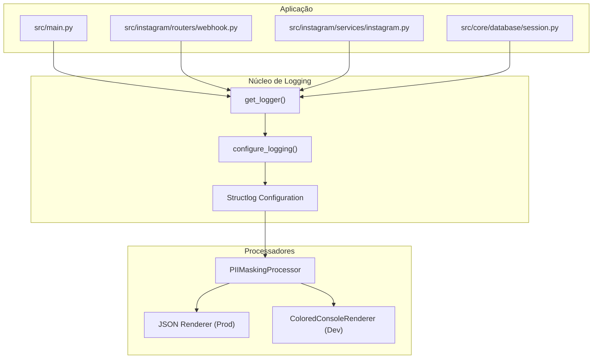
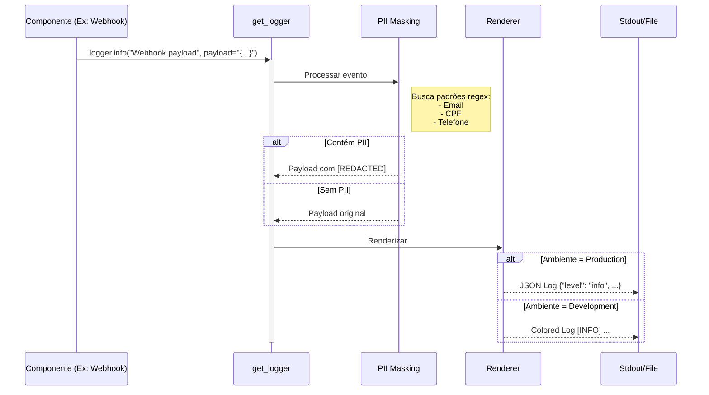

# Relatório de Padronização de Logs e Observabilidade

**Data**: 26/02/2026
**Autor**: Lennon (via Trae AI)
**Atividade**: Padronização do sistema de logs utilizando `structlog` e mascaramento de PII.

## 1. Observação

### Local
A intervenção foi realizada nos seguintes arquivos, que utilizavam configurações de log manuais ou o logger padrão do Python sem as configurações globais do projeto:

- `src/main.py` (Ponto de entrada da aplicação)
- `src/core/database/session.py` (Gerenciamento de conexão com banco de dados)
- `src/instagram/routers/webhook.py` (Recepção de eventos da Meta/Instagram)
- `src/instagram/services/instagram.py` (Comunicação com a Graph API e Send API)

### Problema
O sistema apresentava inconsistência na emissão de logs:
1. **Logs não estruturados**: Uso de `logging.basicConfig` e `logging.getLogger` diretamente, ignorando a configuração centralizada que provê logs em JSON (para produção) e coloridos (para desenvolvimento).
2. **Risco de Vazamento de Dados (PII)**: O logger padrão não passava pelos processadores de mascaramento (`PIIMaskingProcessor`), permitindo que dados sensíveis como emails, CPFs ou telefones fossem gravados em texto plano nos logs.
3. **Dificuldade de Rastreabilidade**: Sem a estruturação uniforme, a ingestão de logs por ferramentas de monitoramento (Datadog, CloudWatch, ELK) torna-se complexa e propensa a erros de parsing.

### Risco
- **Segurança**: Exposição de dados sensíveis de usuários (LGPD/GDPR) em arquivos de log ou consoles de monitoramento.
- **Operacional**: Dificuldade em debugar problemas em produção devido à mistura de formatos de log (texto plano vs JSON) e falta de contexto padronizado.

### Solução
Substituição de todas as instâncias de `logging.getLogger(__name__)` e configurações manuais por `src.core.utils.logging.get_logger(__name__)`.

Esta função garante que:
1. O logger retornado é uma instância de `structlog`.
2. Todos os processadores configurados (incluindo `PIIMaskingProcessor`) são aplicados.
3. O formato de saída respeita o ambiente (`development` = colorido, `production` = JSON).

---

## 2. Detalhes da Implementação

### Diagrama de Componentes de Logging

### Fluxo de Processamento de um Log

Quando um log é emitido (ex: payload de webhook), ele passa pelo seguinte pipeline:

---

## 3. Decisões e Resultados

### Alterações Realizadas

| Arquivo | Alteração | Motivo |
|---|---|---|
| `src/main.py` | Removeu `logging.basicConfig` manual; Adotou `get_logger` | Centralizar configuração e evitar conflito de handlers. |
| `src/core/database/session.py` | `logging.getLogger` → `get_logger` | Garantir que erros de conexão de banco sejam estruturados. |
| `src/instagram/routers/webhook.py` | `logging.getLogger` → `get_logger` | Mascarar dados de usuários vindos nos payloads da Meta. |
| `src/instagram/services/instagram.py` | `logging.getLogger` → `get_logger` | Mascarar URLs ou dados sensíveis em chamadas externas. |

### Resultado Final
- **Consistência**: Toda a aplicação agora "fala a mesma língua" nos logs.
- **Segurança**: Dados sensíveis são sanitizados automaticamente antes de serem escritos.
- **Manutenibilidade**: A alteração da estratégia de log (ex: enviar para um arquivo ou serviço externo) agora pode ser feita em um único ponto (`src/core/utils/logging.py`) e refletirá em todo o projeto.

### Próximos Passos (Recomendação)
- Verificar se bibliotecas de terceiros (como `uvicorn` ou `httpx`) também estão respeitando a configuração de log ou se precisam de interceptadores para mascaramento de PII.
- Adicionar `structlog.contextvars` para rastrear `request_id` através de middlewares, permitindo correlacionar logs de uma mesma requisição HTTP.
