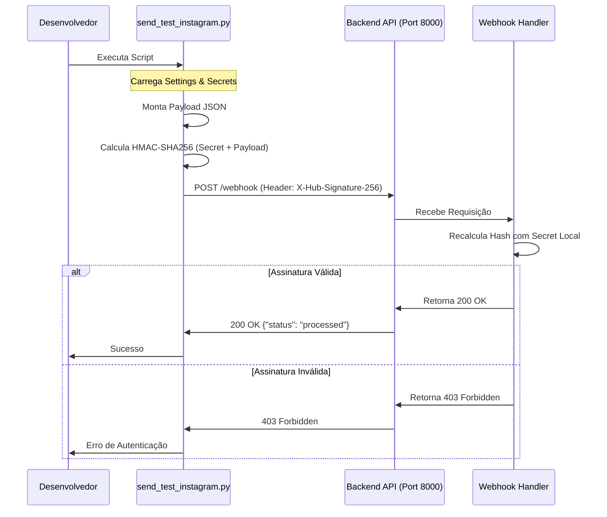

# Relatório de Correções e Melhorias de Segurança

## Resumo Executivo
Este relatório documenta as intervenções realizadas para corrigir falhas de conexão no ambiente de desenvolvimento, implementar validação de segurança em webhooks e sanitizar dados sensíveis expostos na documentação. As ações visaram restabelecer a funcionalidade dos testes de integração e elevar o padrão de segurança do projeto.

---

## 1. Sanitização de Dados Sensíveis

### Local
- `docs/examples_payloads.md`

### Problema
O arquivo de documentação continha **Identificadores (IDs)** reais de contas do Instagram e IDs de mensagens longos, expondo informações potencialmente sensíveis (PII) no repositório.

### Risco
- **Exposição de PII**: IDs reais podem ser usados para engenharia social ou ataques direcionados.
- **Vazamento de Metadados**: IDs de mensagens podem revelar padrões de tráfego ou timestamps internos.

### Solução
- **Sanitização**: Substituição de todos os IDs reais por valores fictícios padronizados (`123456789...`) e IDs de mensagem por strings genéricas (`mid.$...`).
- **Verificação**: Confirmação de que os IDs removidos não eram dependências hardcoded em testes automatizados.

---

## 2. Atualização de Configurações (Settings)

### Local
- `src/core/config/settings.py`
- `.env.example`

### Problema
As configurações da aplicação não refletiam a necessidade de IDs específicos (`user_id`, `page_id`) para testes e operações da API do Instagram, obrigando o uso de valores hardcoded ou faltantes.

### Risco
- **Dívida Técnica**: Valores hardcoded dificultam a manutenção e a troca de ambientes.
- **Configuração Incompleta**: Novos desenvolvedores não teriam visibilidade das variáveis necessárias.

### Solução
- **Expansão do Modelo**: Adição dos campos `user_id` e `page_id` na classe `InstagramSettings` em `src/core/config/settings.py`.
- **Documentação**: Atualização do `.env.example` para incluir as novas variáveis de ambiente requeridas.

---

## 3. Correção de Conexão e Autenticação de Webhook

### Local
- `scripts/instagram/send_test_instagram.py`
- Ambiente de Execução (Terminal)

### Problema
1.  **Connection Refused**: O script de teste falhava ao tentar conectar na porta 8000 pois o servidor backend não estava ativo.
2.  **403 Forbidden (Assinatura Inválida)**: Após conectar, o webhook rejeitava a requisição por falta da assinatura HMAC-SHA256 correta.

### Risco
- **Bloqueio de Desenvolvimento**: Incapacidade de testar fluxos de webhook localmente.
- **Falso Positivo de Segurança**: Testar sem assinatura em dev poderia mascarar falhas de validação em produção.

### Solução
1.  **Inicialização do Servidor**: Execução do backend via `make run` para disponibilizar a API.
2.  **Implementação de HMAC**: Atualização do script `send_test_instagram.py` para calcular dinamicamente a assinatura `X-Hub-Signature-256` usando o `INSTAGRAM_APP_SECRET` configurado, mimetizando o comportamento real da Meta.

### Diagrama de Sequência (Fluxo Corrigido)

---

## Conclusão
As correções garantiram que o ambiente de desenvolvimento local seja funcional e seguro, refletindo fielmente as exigências de segurança da API oficial do Instagram. A documentação foi limpa de dados reais, protegendo a privacidade dos envolvidos.
